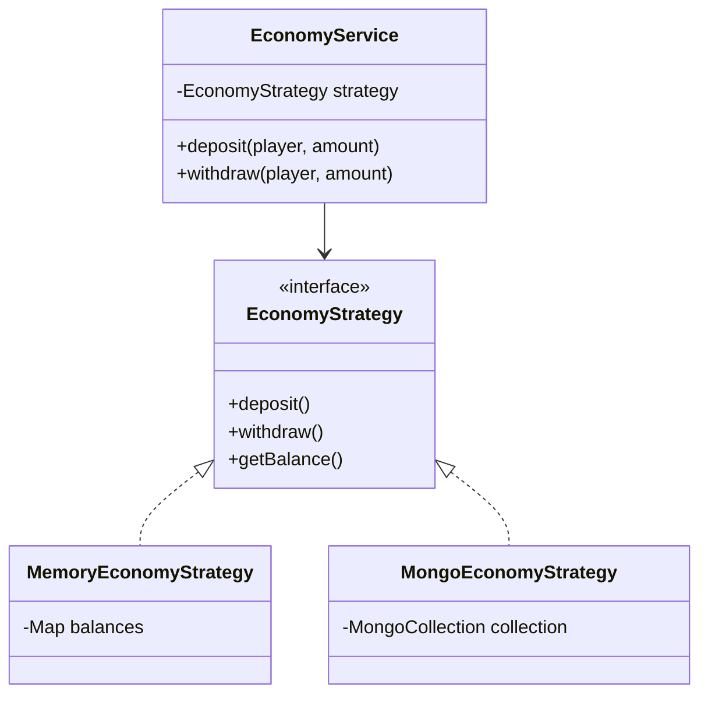

# 📅 DevLog: Economy System Architecture
#Architecture #Economy #DesignPattern #Java

## 📝 주제: 유연한 경제 시스템 설계 (Strategy & Factory)

> [!INFO] **요약**
> 펠릭스님의 멘토링을 바탕으로 **Strategy**와 **Factory** 패턴을 적용하여, 저장소 변경에 유연한 경제 시스템을 구축했습니다.
> 핵심은 **비즈니스 로직(Service)**과 **데이터 처리(Storage)**의 완전한 분리입니다.

---

### 1. 🧠 Brainstorming & Design Strategy
**"어떻게 하면 DB가 바뀌어도 코드를 안 고칠 수 있을까?"**

- **문제 상황**: 처음엔 `HashMap`으로 개발하다가 나중에 `MySQL`이나 `MongoDB`로 넘어가야 하는데, 그때마다 `EconomyService` 코드를 다 뜯어고쳐야 한다면? 😫
- **해결 아이디어**:
    - `EconomyService`는 "누구에게 돈을 준다/뺏는다"는 개념만 알면 됨.
    - 실제로 "어디에 저장할지"는 몰라도 됨.
    - 👉 **Strategy Pattern** 당첨!

### 2. 핵심 기능 (Core Features)
1. **Account Management**: 접속 시 자동 계정 생성 (없는 경우 0원으로 초기화)
2. **Transaction**:
    - `deposit(target, amount)`
    - `withdraw(target, amount)`
3. **Data Persistence**:
    - `onDisable()` 시점에 모든 캐시 데이터를 DB로 Flush. (Graceful Shutdown)
4. **Admin Commands**:
    - `/eco <give|take|set> <player> <amount>`

### 3. 기술적 의사결정 (Technical Decisions)

> [!TIP] **Factory Pattern의 도입**
> `config.yml`에서 `storage.type: MONGODB` 한 줄만 바꾸면, 서버 재시작 시 자동으로 `MongoEconomyStrategy`가 주입됩니다.
> `EconomyFactory` 클래스가 이 분기 처리를 담당하여 Main 코드를 깔끔하게 유지합니다.

### 4. 🔗 System Relationships & Gap Analysis

> [!WARNING] **Missing Features & Gaps**
> 1. **상점 시스템 (Shop)**: 돈을 벌고 쓸 곳이 필요함. `Log_01` 시점에는 구상만 하고 구현되지 않음.
>    - [[Log_03_Cosmetic_Architecture]]에서 상점이 언급되지 않음. 치장 아이템 구매와 연결 필요.
> 2. **재화의 종류**: 현재는 단일 통화(Balance)만 고려됨.
>    - 유료 재화(Cash), 마일리지(Mileage) 등 **Multi-Currency** 지원 확장성 검토 필요.
> 3. **동시성 문제**: `Log_01` 시점에는 `synchronized`나 `DB Lock`에 대한 대비가 부족했음.
>    - 👉 [[Log_04_Database_Optimization]]에서 Redis Lua Script로 해결됨.

### 5. Next Actions
- [x] Strategy 패턴 구현
- [ ] [[Log_04_Database_Optimization]] 내용을 바탕으로 동시성 테스트 진행
- [ ] 상점(Shop) 기획 및 Economy 연동 설계