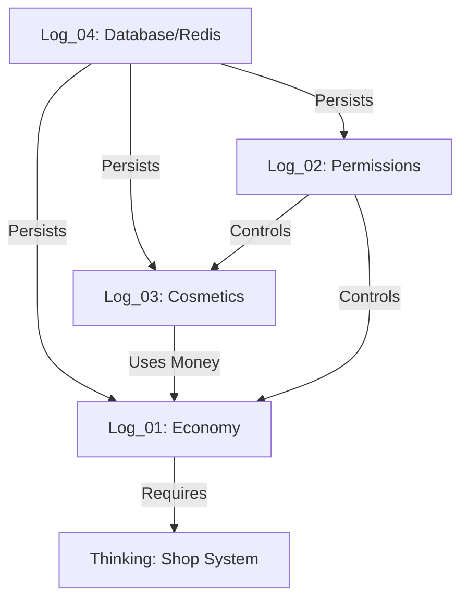

# 🗺️ MCUniverse Development Log Index
#Index #MapOfContent #Overview

## 📚 Development Logs
| ID | Date | Topic | Key Patterns |
| :--- | :--- | :--- | :--- |
| [[Log_01_Economy_System]] | 2026-01-31 | **Economy** | Strategy, Factory |
| [[Log_02_Permission_Essentials]] | 2026-02-01 | **Permissions** | Annotation(Lamp), Feature |
| [[Log_03_Cosmetic_Architecture]] | 2026-02-02 | **Cosmetics** | OCP, Decorator, Registry |
| [[Log_04_Database_Optimization]] | 2026-02-03 | **Database** | Async, Caching(Redis), Lua Script |

---

## 🔗 System Relationship Map (Network View)

## 🧠 Missing Links & Gap Analysis (Project Review)

> [!TODO] **1. Shop System (The Missing Piece)**
> `Log_01`(경제)과 `Log_03`(치장)을 이어주는 **상점(Shop)**이 아직 구현되지 않았습니다.
> - 유저는 돈을 벌고(Eco) -> 상점에서 물건/치장을 사고(Shop) -> 치장을 장착(Cos)하는 사이클이 완성되어야 합니다.

> [!TODO] **2. Rank Data Migration**
> `Log_02`의 랭크 시스템이 아직 Memory/Config 기반입니다.
> `Log_04`의 DB 인프라가 구축되었으므로, **랭크 데이터도 Redis/DB로 이관**하여 멀티 서버 환경에 대비해야 합니다.

> [!TODO] **3. UI/UX (GUI System)**
> 명령어(`/eco`, `/cosmetic`) 만으로는 접근성이 떨어집니다.
> 인벤토리 기반의 **GUI(Menu) 프레임워크** 설계가 필요합니다. 상점과 치장함은 필수적으로 GUI가 필요합니다.

## ✨ Next Sprint Recommendation
1. **Shop System 설계 및 구현**: 경제와 치장을 연결.
2. **GUI Framework 도입**: 상점과 치장함을 시각화.
3. **Rank DB Integration**: 펄미션 시스템 고도화.
